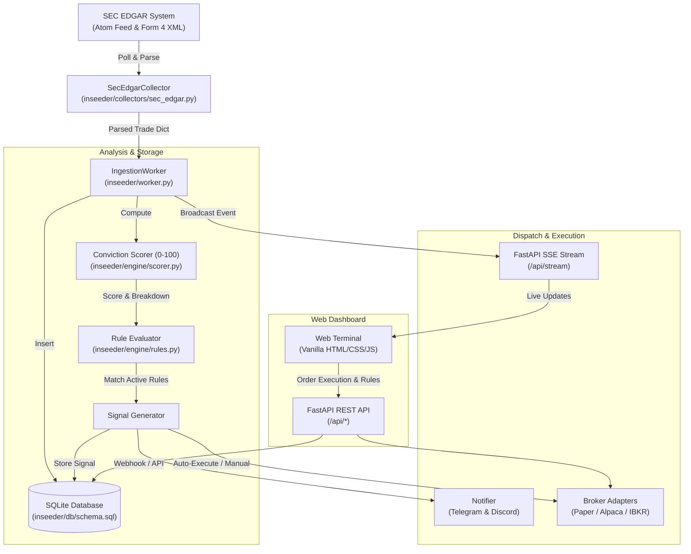

# INseeder: US Equities Insider Radar & Copy-Trade System

[](https://www.python.org/)
[](https://fastapi.tiangolo.com/)
[-003B57.svg)](https://sqlite.org/)
[](LICENSE)
[](tests/)

**INseeder** is an automated, real-time US equities insider trading detection, quantitative conviction scoring, alerting, and copy-trading terminal. It ingests public SEC EDGAR Form 4 filings, extracts transaction details, evaluates insider seniority and buying patterns, scores conviction from 0 to 100, and routes signals to alerting channels (Telegram/Discord) and brokerage execution adapters (Paper Trading, Alpaca Markets, Interactive Brokers).

The system includes a built-in dark-themed web terminal powered by Server-Sent Events (SSE) for live stream monitoring and portfolio tracking with zero external frontend dependencies.

---

## Key Features

- **Automated SEC EDGAR Ingestion:** Continuously polls the official SEC EDGAR Form 4 Atom feed and parses XML filings with built-in SEC Fair Access rate limiting and custom `User-Agent` headers.
- **Quantitative Conviction Model (0–100):** Evaluates insider seniority, transaction dollar value, percentage holding increase, 7-day multi-insider cluster buying, and discretionary vs. Rule 10b5-1 planned trades.
- **Dynamic Rule Engine:** Configure custom rules via UI or REST API to filter trades by minimum score, minimum volume, transaction types (`P`, `S`), and executive roles (`CEO`, `CFO`, `Director`, `10% Owner`).
- **Hyperliquid Hub & Derivative Alpha Radar:** Real-time cross-referencing between live Hyperliquid L1 perpetual/spot markets and SEC Form 4 insider activity with funding rates, 24h volume, and open interest metrics.
- **Multi-Channel Alert Dispatcher:** Real-time trade cards sent to Telegram channels and Discord webhooks with direct links to SEC source filings.
- **Pluggable Execution Adapters:**
  - **Internal Paper Broker:** Zero-risk simulation environment with $100,000 initial virtual cash, instant execution, and automated PnL tracking.
  - **Alpaca Markets:** REST API adapter for both Paper and Live order execution.
  - **Interactive Brokers (IBKR):** Extensible adapter for IBKR Client Portal Gateway order routing.
- **Live Dark-Themed Web Terminal:** Real-time trade streaming, conviction leaderboard, rule manager, and paper portfolio monitoring served directly by FastAPI.
- **Historic Backfill CLI:** Standalone utility to fetch, parse, and score past Form 4 filings across customizable date ranges from SEC daily indices.

---

## Architecture

The system operates as an asynchronous, event-driven pipeline:



---

## Quantitative Conviction Scoring Model

Every parsed Form 4 transaction is evaluated by `compute_conviction_score` (`inseeder/engine/scorer.py`) on a 0–100 scale:

| Factor | Criteria / Threshold | Points Awarded |
| :--- | :--- | :--- |
| **Insider Seniority** | Chief Executive Officer (CEO) | **+30** |
| | Chief Financial Officer (CFO) | **+25** |
| | COO / President | **+20** |
| | Director / Board Member / Officer | **+15** |
| | 10%+ Beneficial Owner | **+10** |
| | Other Insiders | **+5** |
| **Transaction Dollar Value** | $\ge \$1,000,000$ | **+35** |
| | $\ge \$500,000$ | **+25** |
| | $\ge \$100,000$ | **+15** |
| | $\ge \$25,000$ | **+5** |
| **Holding Increase** | Position Initiation (0 prior shares) | **+25** |
| | Position increase $\ge 50\%$ | **+25** |
| | Position increase $\ge 20\%$ | **+15** |
| **Cluster Buying** | $\ge 2$ insiders buying same ticker in last 7 days | **+30** |
| **Discretionary Status** | Not executed under Rule 10b5-1 pre-scheduled plan | **+10** |
| **Non-Purchase Constraint** | Open-market sales (`S`) or grants (`A`, `M`) | **Capped at max 30** |

*Maximum achievable score is 100 points. A score of $\ge 60$ is classified as a significant high-conviction signal.*

---

## Project Structure

```
INseeder/
├── inseeder/                    # Core Python package
│   ├── __init__.py              # Package root and version (0.1.0)
│   ├── config.py                # Centralized environment settings
│   ├── worker.py                # IngestionWorker orchestrator & SSE broadcaster
│   ├── api/                     # Web and REST API layer
│   │   ├── __init__.py
│   │   ├── app.py               # FastAPI application factory & lifespan setup
│   │   └── routes.py            # REST endpoints and SSE stream handler
│   ├── collectors/              # Data collection layer
│   │   ├── __init__.py
│   │   └── sec_edgar.py         # SEC EDGAR Atom & Form 4 XML parser
│   ├── db/                      # Persistence layer
│   │   ├── __init__.py
│   │   ├── database.py          # Async SQLite database wrapper (aiosqlite)
│   │   └── schema.sql           # Database schema & indexes
│   ├── engine/                  # Quantitative scoring & filtering
│   │   ├── __init__.py
│   │   ├── rules.py             # Rule matching and filtering engine
│   │   └── scorer.py            # Conviction scoring implementation
│   └── execution/               # Notifications & Broker integrations
│       ├── __init__.py
│       ├── broker_base.py       # IBrokerAdapter abstract base class
│       ├── paper_broker.py      # Virtual simulation broker with PnL tracking
│       ├── alpaca_broker.py     # Alpaca Markets REST API adapter
│       ├── ibkr_broker.py       # Interactive Brokers Client Portal adapter
│       └── notifier.py          # Telegram & Discord webhook dispatcher
├── scripts/                     # Operational and utility scripts
│   └── backfill.py              # Historic SEC Form 4 backfill utility CLI
├── docs/                        # Architecture & technical documentation
│   └── design_spec.md           # Comprehensive design document & system specification
├── web/                         # Frontend assets (served at /)
│   ├── index.html               # Terminal user interface
│   ├── css/
│   │   └── style.css            # Dark-mode styling, glowing badges, layout
│   └── js/
│       └── app.js               # Terminal client logic & SSE stream consumer
├── tests/                       # Automated test suite
│   ├── fixtures/                # Sample test data
│   │   ├── sample_feed.atom     # Sample SEC Atom feed
│   │   └── sample_form4.xml     # Sample Form 4 XML filing
│   ├── test_alpaca_broker.py
│   ├── test_api.py
│   ├── test_config.py
│   ├── test_database.py
│   ├── test_notifier.py
│   ├── test_paper_broker.py
│   ├── test_rules.py
│   ├── test_scorer.py
│   ├── test_sec_parser.py
│   └── test_worker.py
├── .env.example                 # Example environment variables
├── pyproject.toml               # Project metadata & build configuration
└── requirements.txt             # Direct dependencies
```

---

## Prerequisites

- **Python:** 3.11 or higher
- **Operating System:** Linux, macOS, or Windows
- **Network:** Internet access to connect to `https://www.sec.gov`

---

## Installation

1. **Clone the repository:**
   ```bash
   git clone https://github.com/your-username/inseeder.git
   cd inseeder
   ```

2. **Create and activate a virtual environment:**
   ```bash
   # Linux / macOS
   python3 -m venv .venv
   source .venv/bin/activate

   # Windows (PowerShell)
   python -m venv .venv
   .\.venv\Scripts\Activate.ps1
   ```

3. **Install dependencies:**
   ```bash
   pip install -r requirements.txt
   ```

4. **Set up environment variables:**
   ```bash
   cp .env.example .env
   ```

---

## Quick Start

Launch the FastAPI application and background ingestion worker with Uvicorn:

```bash
uvicorn inseeder.api.app:app --host 0.0.0.0 --port 8000 --reload
```

Once running:
- **Web Terminal:** Open [http://localhost:8000/](http://localhost:8000/) in your browser.
- **Interactive API Documentation:** Open [http://localhost:8000/docs](http://localhost:8000/docs) (Swagger UI).
- **Alternative API Documentation:** Open [http://localhost:8000/redoc](http://localhost:8000/redoc) (ReDoc).

### Historic Form 4 Backfill Utility

You can pre-populate the database with historical SEC Form 4 filings using the backfill CLI:

```bash
# Backfill the past 5 business days (default)
python scripts/backfill.py --days 5

# Or backfill specific dates (YYYYMMDD format)
python scripts/backfill.py --dates 20260918 20260917 20260916
```

---

## Configuration

INseeder can be configured via environment variables (or `.env` file) as well as programmatically:

### Environment Variables

| Variable | Default | Description |
| :--- | :--- | :--- |
| `INSEEDER_DB_PATH` | `inseeder.db` | SQLite database file location |
| `SEC_USER_AGENT` | `INseeder Research admin@inseeder.local` | Compliant SEC User-Agent header |
| `POLL_INTERVAL_SEC` | `30.0` | SEC Form 4 feed polling interval (seconds) |
| `TELEGRAM_BOT_TOKEN` | `""` | Telegram Bot API token for alerts |
| `TELEGRAM_CHAT_ID` | `""` | Telegram destination chat ID |
| `DISCORD_WEBHOOK_URL`| `""` | Discord webhook URL for alerts |
| `DEFAULT_BROKER` | `paper` | Active broker adapter (`paper`, `alpaca`, `ibkr`) |
| `ALPACA_API_KEY` | `""` | Alpaca Markets API key ID |
| `ALPACA_API_SECRET` | `""` | Alpaca Markets API secret key |
| `ALPACA_BASE_URL` | `https://paper-api.alpaca.markets` | Alpaca API endpoint URL |
| `IBKR_BASE_URL` | `https://localhost:5000/v1/api` | IBKR Client Portal gateway URL |
| `IBKR_ACCOUNT_ID` | `""` | IBKR account ID |

---

## REST API Reference

| Method | Endpoint | Description | Request Body / Parameters |
| :--- | :--- | :--- | :--- |
| `GET` | `/api/trades` | Fetch ingested insider trades | `limit` (int), `offset` (int), `ticker` (str, optional) |
| `GET` | `/api/signals` | Fetch generated high-conviction signals | `limit` (int), `offset` (int) |
| `GET` | `/api/rules` | List user filter and copy-trading rules | `active_only` (bool, default `false`) |
| `POST` | `/api/rules` | Create a new trading rule | JSON body (`RuleCreate` schema) |
| `DELETE` | `/api/rules/{id}` | Delete a rule by its ID | Path parameter `id` (int) |
| `GET` | `/api/portfolio` | Retrieve cash balance, positions, and orders | None |
| `POST` | `/api/orders/execute` | Manually submit an order | JSON body (`OrderExecute` schema) |
| `GET` | `/api/hyperliquid/markets` | Cross-reference live Hyperliquid L1 markets with SEC Form 4 insider trading | None |
| `GET` | `/api/stream` | Server-Sent Events (SSE) live event stream | None |

### Creating a Rule Example (`POST /api/rules`)

```json
{
  "name": "CEO Cluster Buys",
  "is_active": 1,
  "min_score": 75,
  "min_value": 100000.0,
  "allowed_roles": ["CEO", "CFO"],
  "allowed_types": ["P"],
  "auto_execute": 0,
  "broker_target": "paper",
  "position_size_usd": 10000.0
}
```

### Executing an Order Example (`POST /api/orders/execute`)

```json
{
  "symbol": "AAPL",
  "qty": 50.0,
  "side": "buy",
  "price": 180.50,
  "signal_id": 1,
  "broker": "paper"
}
```

---

## Testing

The test suite validates all parsers, conviction scoring logic, database operations, brokers, notifiers, and API endpoints.

Run all tests with `pytest`:

```bash
pytest -v
```

---

## Troubleshooting

### 1. SEC Rate Limiting (HTTP 429)
- **Cause:** Exceeding the SEC Fair Access limit of 10 requests per second.
- **Solution:** Ensure `SEC_USER_AGENT` contains a compliant contact email. Increase `POLL_INTERVAL_SEC` to 30s or higher.

### 2. SQLite Database Locking
- **Cause:** Concurrent access across multiple processes.
- **Solution:** Run Uvicorn with a single worker process (`--workers 1`), as `aiosqlite` manages asynchronous queries sequentially on a single SQLite file.

### 3. Telegram or Discord Alerts Not Dispatched
- **Cause:** Missing or invalid bot token, chat ID, or webhook URL.
- **Solution:** Ensure the bot is invited to the target channel with message posting permissions. The `Notifier` class is designed to log warnings without raising unhandled exceptions if the network fails.

### 4. Alpaca Order Rejection
- **Cause:** Using Paper Trading credentials against the Live Trading endpoint (or vice versa), or insufficient buying power.
- **Solution:** Verify `ALPACA_BASE_URL` is set to `https://paper-api.alpaca.markets` for paper keys, and check account buying power via `GET /api/portfolio`.

---

## Limitations

- **Authentication:** The REST API and SSE endpoints do not currently enforce authentication or authorization. Do not expose the server directly to the public internet without a reverse proxy (e.g., NGINX with HTTP Basic Auth or OAuth).
- **Interactive Brokers Adapter:** The `IBKRBroker` implementation is currently a client bridge for the IBKR Client Portal Gateway and returns simulated responses for order submissions.
- **Database Engine:** Persistence is based on SQLite (`aiosqlite`). It is designed for single-instance deployments and is not suited for multi-node distributed clusters without migrating to PostgreSQL.

---

## License

This project is licensed under the MIT License - see the [LICENSE](LICENSE) file for details.
